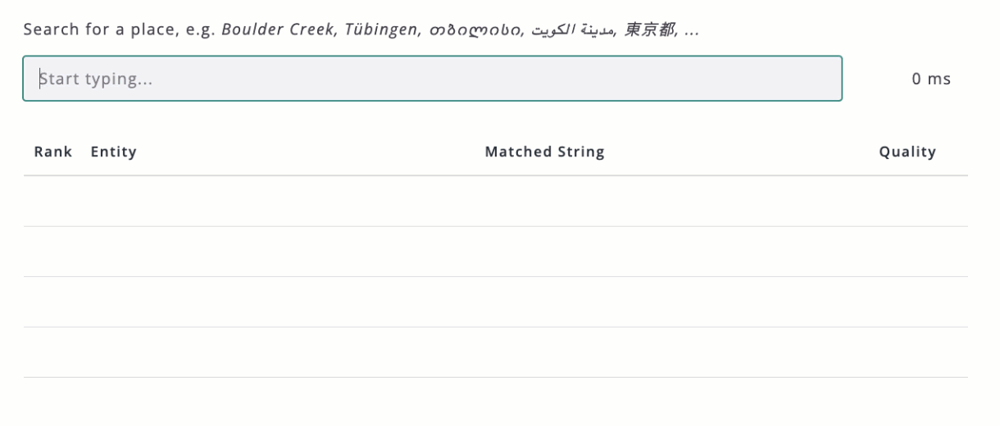

# Frontend Fuzzy Search

@m31coding/fuzzy-search is a frontend library for searching objects with ids (entities) by their names and features (terms). It is

- Fast: A query takes usually well below 10 ms. 
- Accurate: Powered by n-grams with a novel approach of character sorting.
- Multilingual: The language-agnostic design of the algorithm enables operation across all languages.
- Flexible: Entities and their terms can be inserted, updated and removed.
- Reliable: Well tested standalone library with no dependencies.

[](https://github.com/m31coding/fuzzy-search/blob/master/LICENSE)
[](https://www.npmjs.com/package/@m31coding/fuzzy-search)
[](https://github.com/m31coding/fuzzy-search/actions/workflows/ci.yml)
[](https://www.m31coding.com)
[](https://www.youtube.com/channel/UC6CZ_Bcyql1kfHZvx9W85mA)
[](https://X.com/m31coding)

- [Related blog post](https://www.m31coding.com/blog/fuzzy-search.html)
- [**Try the demo**](https://www.m31coding.com/fuzzy-search-demo.html)




## Installation

Install the package via npm:

```bash
npm install @m31coding/fuzzy-search
```

The following files are available in the dist folder for different use cases:

- fuzzy-search.module.js (ESM)
- fuzzy-search.cjs (CommonJS)
- fuzzy-search.umd.js (UMD)
- fuzzy-search.modern.js (Modern mode)
- fuzzy-search.d.ts (TypeScript definitions)

This library uses [microbundle](https://github.com/developit/microbundle). Please consult their documentation for more information on how to use the different files.


## Usage

The most important definitions can be found in the folder [interfaces](src/interfaces). For creating a searcher, use the [SearcherFactory](src/searcher-factory.ts).
Here is a basic usage example (esm module syntax):

```js
import * as fuzzySearch from './path/to/fuzzy-search.module.js';

const searcher = fuzzySearch.SearcherFactory.createDefaultSearcher();

const persons = [
  { id: 23501, firstName: 'Alice', lastName: 'King' },
  { id: 99234, firstName: 'Bob', lastName: 'Bishop' },
  { id: 5823, firstName: 'Carol', lastName: 'Queen' },
  { id: 11923, firstName: 'Charlie', lastName: 'Rook' }
];

const indexingMeta = searcher.indexEntities(
  persons,
  (e) => e.id,
  (e) => [e.firstName, e.lastName, `${e.firstName} ${e.lastName}`]
);
console.dir(indexingMeta);
/* {
  "entries": {
    "numberOfInvalidTerms": 0,
    "numberOfDistinctTerms": 12,
    "normalizationDuration": 0,
    "numberOfSurrogateCharacters": 0,
    "indexingDuration": 1
  }
} */

const result = searcher.getMatches(new fuzzySearch.Query('alice kign'));
console.dir(result);
/* {
  "matches": [
    {
      "entity": {
        "id": 23501,
        "firstName": "Alice",
        "lastName": "King"
      },
      "quality": 0.8636363636363635,
      "matchedString": "Alice King"
    }
  ],
  "query": {
    "string": "alice kign",
    "topN": 10,
    "minQuality": 0.3
  },
  "meta": {
    "entries": {
      "queryDuration": 0
    }
  }
} */

const removalResult = searcher.removeEntities([99234, 5823]);
console.dir(removalResult);
/* {
  "removedEntities": [
    99234,
    5823
  ],
  "meta": {
    "entries": {
      "removalDuration": 0
    }
  }
} */

const persons2 = [
  { id: 723, firstName: 'David', lastName: 'Knight' }, // new
  { id: 2634, firstName: 'Eve', lastName: 'Pawn' }, // new
  { id: 23501, firstName: 'Allie', lastName: 'King' }, // updated
  { id: 11923, firstName: 'Charles', lastName: 'Rook' } // updated
];

const upsertMeta = searcher.upsertEntities(
  persons2,
  (e) => e.id,
  (e) => [e.firstName, e.lastName, `${e.firstName} ${e.lastName}`]
);
console.dir(upsertMeta);
/* {
  "entries": {
    "numberOfInvalidTerms": 0,
    "numberOfDistinctTerms": 12,
    "normalizationDuration": 0,
    "numberOfSurrogateCharacters": 0,
    "upsertDuration": 0
  }
} */

const result2 = searcher.getMatches(new fuzzySearch.Query('allie'));
console.dir(result2);
/* {
  "matches": [
    {
      "entity": {
        "id": 23501,
        "firstName": "Allie",
        "lastName": "King"
      },
      "quality": 1,
      "matchedString": "Allie"
    }
  ],
  "query": {
    "string": "allie",
    "topN": 10,
    "minQuality": 0.3
  },
  "meta": {
    "entries": {
      "queryDuration": 0
    }
  }
} */
```

The following parameters are available when creating a query:

| Parameter | Type | Default | Description |
| --------- | ---- | ------- | ----------- |
| string | string | - | The query string. |
| topN | number | 10 | The maximum number of matches to return. Provide Infinity to return all matches. |
| minQuality | number | 0.3 | The minimum quality of a match, ranging from 0 to 1. When set to zero, all terms that share at least one common n-gram with the query are considered a match. |

If the data terms contain characters and strings in non-latin scripts (such as Arabic, Cyrillic, Greek, Han, ... see also [ISO 15924](https://en.wikipedia.org/wiki/ISO_15924)), the default configuration must be adjusted before creating the searcher:

```js
const config = fuzzySearch.Config.createDefaultConfig();
config.normalizerConfig.allowCharacter = (_c) => true;
const searcher = fuzzySearch.SearcherFactory.createSearcher(config);
```

Moreover, if your dataset is large (> 100.000 terms), you may index the searcher in a web worker to avoid blocking the main thread, as shown in [this](usage-examples/worker) usage example.

If your objects cannot be identified by a unique id, you can also pass `(e) => e` for the `getId` parameter of both `indexEntities` and `upsertEntities`. Just be aware that the `getId` function is used for equality checks and the creation of Maps, particularly utilized by the `upsertEntities` and `removeEntities` methods. For indexing plain strings, you can call:

```js
const indexingMeta = searcher.indexEntities(
  ["Alice", "Bob", "Carol", "Charlie"],
  (e) => e,
  (e) => [e]
);
```

To try the demo and usage examples locally, clone the repository and execute the commands: 

```bash
npm install
npm run build
```

To proceed, open the html file of interest (e.g., `fuzzy-search-demo.html`) with a local webserver. If you use VS Code, you may use the [Live Server extension](https://marketplace.visualstudio.com/items?itemName=ritwickdey.LiveServer) for this purpose.


## Upsert and removal

This library was optimized for fast querying. At its core, a searcher employs integer indexes that can not be easily updated. The upsert operation is implemented by reindexing a secondary searcher, which is initially empty. Removal is implemented by blacklisting entities. 

Consequently, repeated upsert operations with a large number of entities may be costly. In such cases, consider reindexing the searcher from scratch by calling the `index` method eventually.


## Normalization

Query strings and data terms are normalized in the following normalization pipeline (order matters):

- Null and undefined strings are replaced by an empty string.
- Strings are lowercased and normalized to NFKC.
- Replacements are applied to characters such as å -> aa, æ -> ae. See also [Latin replacements](src/normalization/latin-replacements.ts).
- Strings are normalized to NFKD.
- Space equivalent characters are replaced by a space.
- Surrogate characters, padding characters and other non-allowed characters are removed.
- Strings are padded to the left, right and in the middle (replacement of spaces).

>Normalization to NFKC decomposes characters by compatibility, then re-composes them by canonical equivalence. This ensures that the characters in the replacement table always match. Normalization to NFKD decomposes the characters by compatibility but does not re-compose them, allowing undesired characters to be removed thereafter.

The default normalizer config adopts the following values:

```js
let paddingLeft = '$$';
let paddingRight = '!';
let paddingMiddle = '!$$';
let replacements = [fuzzySearch.LatinReplacements.Value];
let spaceEquivalentCharacters = new Set(['_', '-', '–', '/', ',', '\t']);
let treatCharacterAsSpace = (c) => spaceEquivalentCharacters.has(c);
let allowCharacter = (c) => {
  return fuzzySearch.StringUtilities.isAlphanumeric(c);
};
```

With this pipeline and configuration, the string `Thanh Việt Đoàn` is normalized to `thanh viet doan` before padding. With padding applied, it becomes `$$thanh!$$viet!$$doan!`. The choice of the padding is explained in the next section.

## Sorted n-grams

The general idea of n-grams and the sorting trick is outlined in this [blog post](https://www.m31coding.com/blog/fuzzy-search.html). In short, the data terms and the query string are broken down into 3-grams, e.g. the string `$$sarah!` becomes:

```text
$$s, $sa, sar, ara, rah, ah!
``````

The more common 3-grams between the query and the term, the higher the quality of the match. By padding the front with two characters, and the back with one character, more weight is given to the beginning of the string.

In addition, the characters of the 3-grams that don't contain '\$' are sorted:

```text
$$s, $sa, ars, aar, ahr, !ah
```

Sorting the characters increases the number of common n-grams for transposition errors, one of the most common types of errors in human typing. Not sorting the first n-grams assumes that transpositions are less likely to occur at the beginning of a string.

The quality is then computed by dividing the number of common n-grams by the number of n-grams of the longer string, query or term. Moreover, a 5% penalty is given if the query string does not match the term exactly. This accounts for the fact that even if two strings have the same 3-grams, they are not necessarily the same, i.e., compare `aabaaa` and `aaabaa`. With this approach, the following quality values are obtained:

| Query | Term  | Padded query | Padded term | Common 3-grams | Quality               |
| ----- | ----- | ------------ | ----------- | ---------------|-----------------------|
| sarah | sarah | $$sarah!     | $$sarah!    | 6              | 6 / 6 = 1.0           |
| sarha | sarah | $$arah!      | $$sarah!    | 5              | 5 / 6 * 0.95 = 0.79   |
| sar   | sarah | $$sar!       | $$sarah!    | 3              | 3 / 6 * 0.95 = 0.475  |
| arah  | sarah | $$arah!      | $$sarah!    | 3              | 3 / 6 * 0.95 = 0.475  |

>Note that I refrain from explicitly computing the Damereau-Levenshtein distance between strings, in order to keep the queries fast. 

Padding strings in the middle allows for extending the algorithm across word boundaries. `sarah wolff` becomes `$$sarah!$$wolff!` and matches `wolff sarah` with a quality of 0.95, if 3-grams that end with a '\$' are discarded.

The overall approach outlined above can be summarized as: remove n-grams that end with '\$', sort n-grams that don't contain '\$'. The default configuration appears in the code as follows:

```js
let ngramN = 3;
let transformNgram = (ngram) =>
  ngram.endsWith('$') ? null
  : ngram.indexOf('$') === -1 ? ngram.split('').sort().join('')
  : ngram;

let inequalityPenalty = 0.05;
```


## Support and Contribution

This library is free. If you find it valuable and wish to express your support, please leave a star. You are kindly invited to contribute. If you see the possibility for enhancement, please create a GitHub issue and you will receive timely feedback.

Happy coding!


